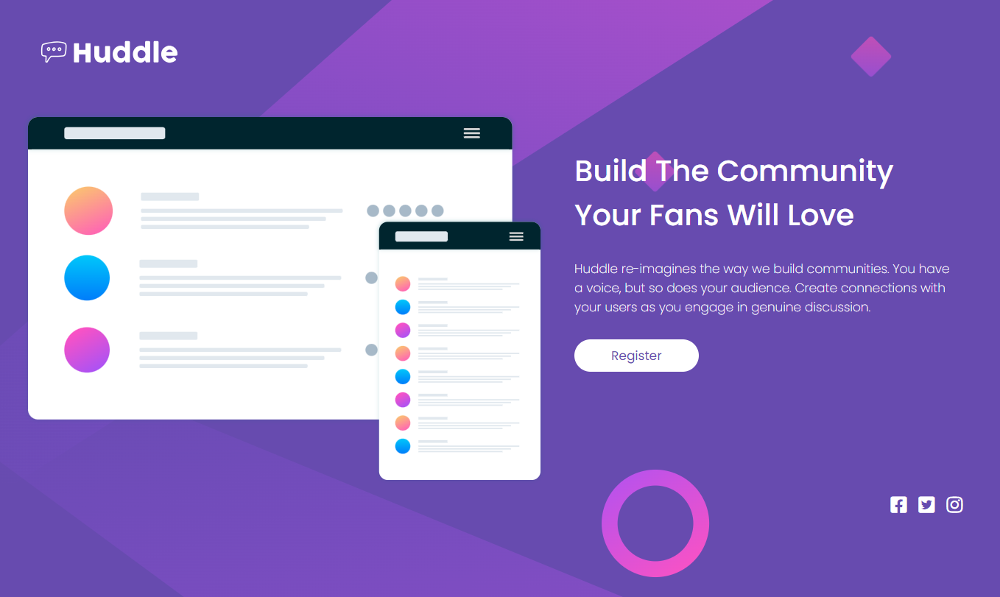
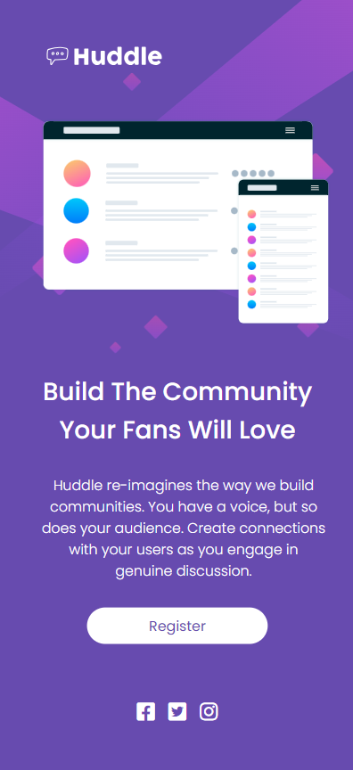

# Huddle
 

## Index

- [About project](#about-project)
- [Overview](#overview)
  - [The challenge](#the-challenge)
  - [Screenshot](#screenshot)
  - [Links](#links)
- [My process](#my-process)
  - [Built with](#built-with)
  - [What I learned](#what-i-learned)
- [Author](#author)

# About projecto

http://127.0.0.1:5500/12-project-huddle/index.html

Esta é uma solução para o desafio [pagina de destino Huddle com seção intodutória única no Frontend Mentor] (https://www.frontendmentor.io/challenges/huddle-landing-page-with-a-single-introductory-section-B_2Wvxgi0).

O intuito é colocar nosso aprendizado em ação para aprimorar nosso conhecimento do curso **Dev em Dobro**, organizado pela [DevQuest] (https://dev-em-dobro.ticto.club/signin?redirect=/content/1806/module/9178/lesson/25478 "Site Dev Quest").

O projeto consiste em criar uma pagina Dev detalhada igual proposta pelo desafio, criando o modelo web e o modelo mobile.

## Overview

### The challenge

Users should be able to:

- View the optimal layout for the page depending on their device's screen size
- See hover states for all interactive elements on the page

### Screenshot

### Links

- Google Fonts URL:
- Awesome URL:
- Notion URL:

## My process

### Built with

- Semantic HTML5 markup
- CSS custom properties
- Flexbox

### What I learned

The project is to help us develop the knowledge obtained so far in the course, using all the technologies that were taught in practice, always aiming for clean code.
The importance of responsiveness to adapt the page to different displays, always focusing on quality

## Author

- Lucas Benevides
- Frontend Mentor - [@lucasbenevides4](https://www.frontendmentor.io/profile/lucasbenevides4)
- Linkedin - [@lucasbenevides4](https://www.linkedin.com/in/lucasbenevides4/)

----------------------------------------------------------

# huddle
Projeto Huddle - Dev Quest - Frontend Mentor

 

## Index

- [About project](#about-project)
- [Overview](#overview)
  - [The challenge](#the-challenge)
  - [Screenshot](#screenshot)
  - [Links](#links)
- [My process](#my-process)
  - [Built with](#built-with)
  - [What I learned](#what-i-learned)
- [Author](#author)

# About projecto

http://127.0.0.1:5500/12-project-huddle/index.html

This is a solution to the challenge [pagina de destino Huddle com seção intodutória única no Frontend Mentor] (https://www.frontendmentor.io/challenges/huddle-landing-page-with-a-single-introductory-section-B_2Wvxgi0).

The aim is to put our learning into action to improve our knowledge of the course **Dev em Dobro**, organized by [DevQuest] (https://dev-em-dobro.ticto.club/signin?redirect=/content/1806/module/9178/lesson/25478 "Site Dev Quest").

The project consists of creating a detailed Dev page similar to that proposed by the challenge, creating the web model and the mobile model.

## Overview

### The challenge

Users should be able to:

- View the optimal layout for the page depending on their device's screen size
- See hover states for all interactive elements on the page

### Screenshot

### Links

- Google Fonts URL:
- Awesome URL:
- Notion URL:

## My process

### Built with

- Semantic HTML5 markup
- CSS custom properties
- Flexbox

### What I learned

The project is to help us develop the knowledge obtained so far in the course, using all the technologies that were taught in practice, always aiming for clean code.
The importance of responsiveness to adapt the page to different displays, always focusing on quality

## Author

- Lucas Benevides
- Frontend Mentor - [@lucasbenevides4](https://www.frontendmentor.io/profile/lucasbenevides4)
- Linkedin - [@lucasbenevides4](https://www.linkedin.com/in/lucasbenevides4/)